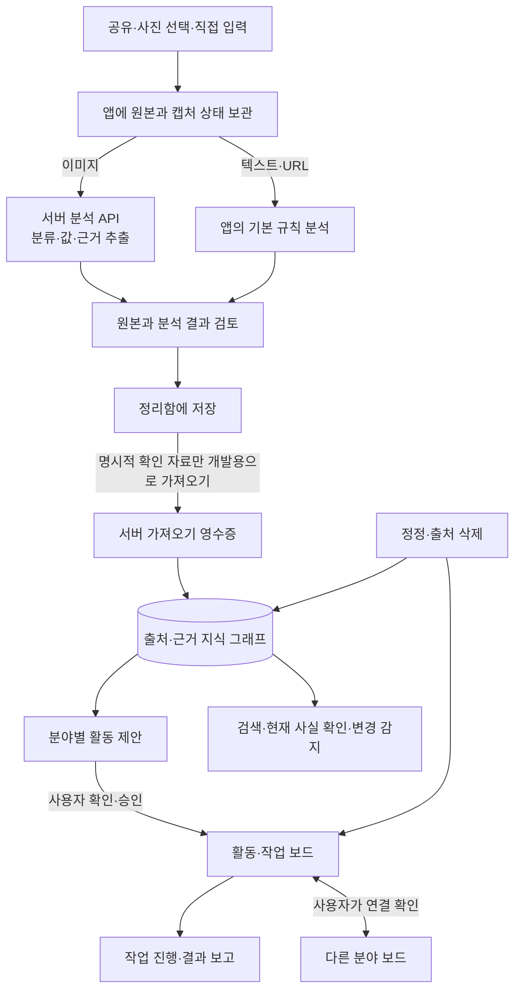
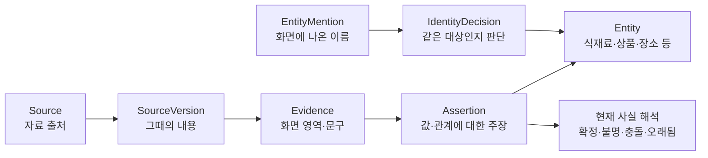

# Luffi 세컨드 브레인: 지금 되는 것과 검증한 것

**팀 공유용 · 2026-09-28 검증 기준 · `dev` 코드 기준 커밋 `00ea7de`**

이 문서는 팀원이 **현재 앱에서 쓸 수 있는 흐름**, **개발 중인 세컨드 브레인 구조**, **테스트가 실제로 확인한 범위**를 구분해서 볼 수 있도록 썼습니다. 코드는 계속 바뀌므로 이 날짜 이후의 동작은 새 커밋과 테스트 결과를 확인해야 합니다.

## 1. 1분 요약

Luffi가 만들려는 것은 캡처를 쌓아 두는 정리함에서 한 단계 더 나아간 **근거 있는 기억과 활동 보드**입니다. 이미지나 공유 글에서 읽은 내용을 출처와 함께 기억하고, 사용자가 확인한 정보를 레시피·맛집·패션·뷰티·여행·생활 꿀팁·쇼핑·건강/운동의 계획과 작업에 연결합니다. 레시피는 이 구조를 깊게 검증한 대표 사례일 뿐, 서비스 전체가 레시피 앱인 것은 아닙니다. 한 자료가 여러 분야에 쓰일 수도 있습니다.

현재는 아래 두 흐름이 함께 있습니다.

| 구분 | 지금 하는 일 | 알아둘 경계 |
| --- | --- | --- |
| **앱의 기본 흐름** | Android 공유·사진 선택으로 자료를 받고, 원본을 기기에 보관합니다. 분석 결과를 확인해 정리함·태그와 기존 계획함에서 사용합니다. | 정리함 검색은 앱에 저장된 콘텐츠·태그를 찾는 기능입니다. 기존 계획함은 아래 개발용 보드와 자동으로 맞춰지지 않습니다. |
| **세컨드 브레인 개발 흐름** | 확인한 구조화 자료를 서버의 근거 그래프에 가져오고, 분야별 활동을 제안·승인해 작업 보드로 만듭니다. 분야 간 연결, 정정, 삭제도 다룹니다. | 현재 **디버그 빌드의 개발용 보드**이며 개발 토큰이 필요합니다. 사용자가 자료를 확인해 가져와도 보드는 따로 만들고 승인해야 합니다. |

가장 중요한 구분은 **① 캡처에서 읽은 내용 ② 사용자가 확인·승인한 계획 ③ 실제로 했다고 보고한 결과**입니다. 이미지를 저장하거나 두 보드를 연결했다고 해서 구매·방문·요리 같은 행동이 완료된 것으로 기록되지는 않습니다.

## 2. 실제로 확인한 흐름: 두부 레시피에서 쇼핑까지

이 사례를 먼저 보면 뒤의 구조가 쉬워집니다. **실제 사용자 사진이 아니라 테스트용으로 만든 이미지 두 장**을 Android 휴대폰에 넣고, 앱 화면과 격리된 서버 상태를 함께 확인했습니다.

| 순서 | 사람이 입력하거나 결정한 것 | 앱·서버에서 확인한 결과 |
| --- | --- | --- |
| **① 공유·분석** | 합성 [레시피 이미지](../server/test/fixtures/variation_recipe_tofu_egg_as_needed.png)와 [쇼핑 이미지](../server/test/fixtures/variation_shopping_tofu_ingredient.png)를 공유했습니다. | 실제 분석 API가 각각 `두부 달걀 볶음 / 레시피 / 내용 충분`, `부침용 두부 300g / 상품 / 내용 충분`으로 표시했습니다. 상품의 `2,400원`은 **캡처에 적힌 가격**입니다. |
| **② 확인·저장** | 원본과 분석 결과를 보고 `정리함에 저장`을 눌렀습니다. | 서버에 서로 다른 **가져오기 영수증 2개**와 활성 캡처 출처 2개가 생겼습니다. 영수증은 어떤 확인 자료를 받아들였는지 추적하는 기록입니다. |
| **③ 레시피 계획 승인** | 기준·목표를 각각 2인분으로 두고, 두부 `300 g`, 달걀 2개(내부 단위: `count`)를 직접 확인한 뒤 계획을 승인했습니다. | 레시피 보드 1개와 작업 4개, 근거가 있는 재료·분량 관계가 생겼습니다. 이미지에서 읽은 값을 자동으로 사실 확정한 결과가 아닙니다. |
| **④ 쇼핑 계획·연결** | 상품을 선택하고 쇼핑 목적을 입력해 계획을 승인한 뒤 레시피와 연결했습니다. | 쇼핑 보드 작업 2개와 활성 연결 1개가 생겼습니다. 이때 **구매 결과는 없었습니다.** |
| **⑤ 필요량 확인** | 레시피 인분을 계산하고, 두부·달걀 재고는 입력하지 않은 채 필요량을 계산했습니다. 쇼핑 계획 변경안도 별도로 승인했습니다. | 쇼핑 화면에 두부 `300 g`·달걀 `2 개`와 **재고 미확인**이 표시됐습니다. 재고를 0으로 추정하거나 상품을 자동 구매하지 않았습니다. |
| **⑥ 삭제·재시작** | 합성 쇼핑 출처 **하나만** 삭제하고 보드를 새로고침한 뒤 앱을 종료·재실행했습니다. | 쇼핑 보드와 연결은 사라지고 독립적인 레시피 보드는 남았습니다. 삭제 기록 검사 결과는 `safe`, 기록은 3건이었습니다. 구매·요리 완료 주장은 0건이었습니다. |

이 **2026-09-28 실물 기기**는 Samsung Galaxy SM-S916N(Android 16/API 36)입니다. Android 시스템 공유 시트를 실제로 거쳤지만, 이미지를 보낸 쪽은 Google Photos가 아니라 테스트 도구 `com.android.shell`이었습니다. PNG를 `image/jpeg`로 잘못 선언한 형식 불일치도 앱이 처리했습니다. **실물 휴대폰의 Google Photos 앱에서 직접 공유한 테스트는 아직 아닙니다.** Google Photos 공유와 서버 중단 후 재시도는 API 35 에뮬레이터에서 확인했습니다. 전날 실물 기기에서는 앱 내부 사진 선택기로 두 이미지를 가져와 보드·삭제·재시작까지 확인했습니다. 실행별 차이는 [Android 검증 원기록](ANDROID_E2E_VALIDATION.md)에 있습니다.

## 3. 자료는 어디를 거쳐 가나

| 단계 | 실제로 저장하거나 판단하는 것 |
| --- | --- |
| **1. 입력 보존** | Android 공유 대기열의 내용을 앱 상태에 저장한 뒤 수신을 완료 처리합니다. 이미지 원본은 기기의 앱 전용 저장소에 남습니다. 분석이 실패해도 입력을 다시 다룰 수 있게 하는 경계입니다. |
| **2. 분석** | 이미지는 서버 `/v1/analyze`에서 분류·제목·필드·근거 영역·누락/충돌을 추출합니다. 텍스트·URL만 있는 입력은 앱의 기본 규칙으로 분석합니다. 여기서 나온 값은 **화면에서 관찰한 후보**이지, 행동 결과나 대상의 동일성을 확정한 사실이 아닙니다. |
| **3. 사용자 확인·정리** | 사용자가 원본과 결과를 보고 정리함에 저장합니다. 구조화 이미지 화면에서는 태그를 선택할 수 있고, 필드 정정은 가져온 자료에 대해 나중에 별도 화면에서 합니다. 일반 정리함·태그·기존 계획은 앱 로컬 상태에 남습니다. |
| **4. 그래프로 가져오기** | 새 구조화 캡처를 **명시적으로 확인**하고 개발용 커널이 연결돼 있으면 가져오기 요청을 예약합니다. 앱은 같은 가져오기 ID와 요청 내용을 보존해 실패 시 재시도합니다. 서버에는 분석 스냅샷·출처·근거·영수증이 남지만 **원본 이미지 파일을 영구 보관하지는 않습니다.** 빠른 정리로 저장한 항목은 자동 대상이 아니고, 과거 자료는 별도 가져오기 명령이 필요합니다. 가져오기만으로 활동 보드가 생기지도 않습니다. |
| **5. 활동으로 만들기** | 사용자가 목적과 필요한 값·단위를 확인합니다. 계획은 먼저 제안되고 **별도 승인 후** 작업 보드에 적용됩니다. 구매·방문·착용·사용·운동·요리 완료는 사용자가 수행 결과를 따로 보고해야 기록됩니다. |
| **6. 고치거나 지우기** | 정정은 근거가 있는 현재 관계에 반영하되, 이미 완료한 결과의 당시 입력은 보존합니다. 출처를 지우면 그 출처에 의존한 그래프·보드·연결도 제거하고, 독립적인 자료는 남깁니다. |

코드에서 이 흐름을 찾으려면 앱 입력·상태의 [`app_controller.dart`](../lib/state/app_controller.dart), 서버 가져오기 클라이언트 [`reviewed_capture_import_client.dart`](../lib/data/reviewed_capture_import_client.dart), 이미지 분석 [`analysis_service.js`](../server/src/analysis_service.js), 서버 [공통 커널](../server/src/common/kernel_service.js), [개발용 보드 화면](../lib/features/boards/common_boards_screen.dart)을 보면 됩니다.

## 4. 지식 그래프는 무엇을 기억하나

여기서 **지식 그래프**는 단순히 이름을 연결한 목록이 아닙니다. “이 값이 어느 캡처의 어느 부분에서 나왔는가”, “사용자가 무엇을 확인했는가”, “지금도 유효한가”를 함께 기록하는 구조입니다. 레시피·상품·장소를 완전히 따로 쌓지 않고 공통 출처·근거·관계 모델로 다룹니다.

예를 들어 화면의 `두부 300g`은 먼저 **캡처에서 읽은 문구**입니다. 사용자가 레시피 재료를 `tofu 300 g`으로 확인하면 **사용자 확인 출처**가 더해지고, 그 근거로 레시피와 재료·분량의 관계가 생깁니다. `EntityMention`은 화면에 나온 이름, `Entity`는 시스템이 추적하는 대상입니다. 둘을 잇는 `IdentityDecision` 없이 이름이 같다는 이유만으로 상품이나 식당을 자동 병합하지 않습니다. 근거가 없거나 충돌하는 값도 확정 사실로 올리지 않습니다.

검색·조회 API는 사용자 소유권과 살아 있는 출처·근거를 다시 검사합니다. 현재 관계는 `resolved`(확정)·`unknown`(불명)·`disputed`(충돌)·`stale`(오래됨)로 해석하고, 변경 감지용 watch도 제공합니다. **앱 정리함의 로컬 검색이 이 그래프 검색으로 바뀐 상태는 아닙니다.** 개발 API는 이름·유형·외부 ID와 제한된 관계 탐색을 지원하지만, 대규모 그래프의 SQL 부분 조회나 완성된 대화형 AI 기억 검색까지 구현한 것은 아닙니다.

개발 기본 저장소는 트랜잭션 JSON 파일입니다. PostgreSQL을 쓰면 그래프는 소유자 정보와 외래키가 있는 관계형 행으로 저장하며, 활동·영수증 등의 일부 상태는 여전히 JSONB에 남습니다. 세부 구조는 [공통 커널 계약](COMMON_KERNEL.md), [지식 그래프 코드](../server/src/knowledge/), [검색 코드](../server/src/retrieval/)에 있습니다.

## 5. 활동 보드는 어떻게 움직이나

보드는 **Activity(하려는 일) → PlanRevision(검토할 계획안) → Task(선행조건과 입출력이 있는 실행 단계) → TaskResult(작업 결과)**로 이어집니다. 작업 간에는 “이 단계를 마쳐야 다음 단계로 간다”는 선행조건이 있습니다. 이를 작업 DAG라고 부릅니다. 계산 결과와 사용자가 보고한 행동 결과는 서로 구분합니다.

계획은 승인 전에는 실행되지 않습니다. 같은 명령을 다시 보내도 명령 ID로 중복 적용을 막습니다. 근거나 입력이 바뀌면 오래된 계획과 미시작 작업을 다시 검토하고, 이미 완료한 결과를 새 값으로 조용히 덮지 않습니다. 현재 작업 틀은 등록된 **분야별 규칙**이 정합니다. AI가 자유로운 문장 하나로 모든 분야의 계획을 자동 생성하는 범용 흐름은 아직 연결되지 않았습니다.

| 분야 | 지금 검증하는 대표 작업과 지켜야 할 구분 |
| --- | --- |
| **레시피** | 사용자가 재료·단위·인분을 확인한 뒤 인분·재고·필요량을 계산하고 요리 결과를 기록합니다. **재고 미확인은 0이 아니며**, `약간`에 임의의 수치를 붙이지 않습니다. |
| **맛집** | 지점 후보를 확인하고 방문 결과를 기록합니다. 같은 상호의 다른 지점을 자동 병합하지 않고, 선택만으로 방문 기록을 만들지 않습니다. |
| **패션** | 코디·옵션·소유 상태를 확인하고 착용 결과를 기록합니다. 화면의 옵션과 실제 소유·착용을 구분합니다. |
| **뷰티** | 제품·루틴 단계·순서를 확인하고 단계별 사용 결과를 기록합니다. 사용하지 않은 단계에 사용 경험을 만들지 않습니다. |
| **여행** | 장소·순서·예정 시각을 확인하고 방문 결과를 기록합니다. 일정에 넣은 것과 실제 방문은 다릅니다. |
| **생활 꿀팁** | 근거가 있는 단계를 선택하고 실행 결과를 기록합니다. 저장한 팁을 실천했다고 간주하지 않습니다. |
| **쇼핑** | 표시 가격·상품 선택·실제 구매·구매 후 재고를 따로 다룹니다. 캡처의 `2,400원`을 결제액으로 취급하지 않습니다. |
| **건강·운동** | 운동 항목·목표 계획과 실제 수행량·결과를 분리합니다. |

분야 간에는 `recipe_shopping`, `travel_dining`, `fashion_beauty`, `health_life_tip` 같은 이름 있는 관계와 일반 `related` 관계가 있습니다. 연결은 **사용자가 확인한 관계**이지, 두 분야의 사실이나 완료 상태를 합치는 명령이 아닙니다. 레시피 필요량을 쇼핑 보드에 보여주는 것은 먼저 읽기 전용이며, 쇼핑 계획에 반영하려면 변경안을 따로 승인해야 합니다. 자세한 조건은 [시나리오 연결 계약](SCENARIO_CONNECTIONS.md)에 있습니다.

## 6. 테스트 결과를 어떻게 읽어야 하나

**2026-09-28에 다시 실행한 자동 검사**는 아래와 같습니다.

| 검사 | 결과 | 이 숫자의 의미 |
| --- | --- | --- |
| 서버 `npm test --prefix server` | **601개 중 598개 통과, 3개 건너뜀, 실패 0개** | 건너뛴 3개는 이번 실행에 별도 테스트용 PostgreSQL 주소가 없어 실행하지 않은 선택 테스트입니다. |
| Flutter 정적 분석 `flutter analyze --fatal-infos` | **문제없음** | 앱 코드의 정적 분석 결과입니다. |
| Flutter `flutter test` | **521개 통과** | 앱 상태·화면 등의 자동 테스트 결과입니다. |
| Android Kotlin `:app:testDebugUnitTest` | **26개 통과** | Android 쪽 단위 테스트 결과입니다. |
| 합성 이미지 `npm run test:corpus-report --prefix server` | **21/21 통과** | 예전에 실제 분석 API에서 받아 보존한 응답을 재생한 회귀 검사입니다. 오늘의 새 모델 정확도 100%라는 뜻이 아닙니다. |

21장은 뷰티 2·맛집 5·패션 2·건강/운동 1·생활 꿀팁 2·레시피 2·쇼핑 5·여행 2장입니다. 이미지 해시와 저장된 응답의 분류·제목·근거 참조를 반복 검사합니다. 분야별 `test:*image-live` 스크립트와 Android 검증에서 합성 이미지를 **실제 분석 API로 보낸 별도 기록**도 있지만, 이번 자동 검사 숫자에 새 모델의 분야별 품질이나 실제 PostgreSQL 선택 테스트 결과를 섞어 넣지 않았습니다.

| 검증 방법 | 확인한 범위 | 아직 알 수 없는 것 |
| --- | --- | --- |
| **자동 회귀** | 그래프·분야별 시나리오·정정/삭제·작업 실행, Flutter 상태·화면을 검사합니다. JSON/PGlite와 선택적 실제 PostgreSQL 통합 검증을 구분합니다. | 휴대폰의 공유·권한·네트워크 변화, 현재 모델 응답의 정확도 |
| **합성 이미지 저장 응답 21장** | 실제 분석 호출에서 저장한 결과가 바뀌지 않았는지 확인합니다. 입력 예시는 [이미지 검증 안내](TEST_VALIDATION_GUIDE.md)에 있습니다. | 현재 모델의 새 응답, 실제 SNS 캡처의 정확도 |
| **합성 이미지 실제 API 호출** | 여러 분야의 이전 실행과 위 Android 사례에서 이미지를 전송해 결과를 확인했습니다. | 다른 이미지까지 일반화할 수 있는 성능 수치 |
| **Android 수동 E2E** | 실물 기기와 에뮬레이터에서 입력→분석→그래프→보드 흐름을 조작했습니다. | iOS 실기기, 모든 외부 앱·형식·제조사, 실제 사용자 자료의 품질 |
| **실제 자료 평가 준비** | 동의·라벨·개발/최종 세트 분리·해시·실행 기록을 검사할 도구와 계약을 준비했습니다. | 실제 자료의 분야별 정확도·속도·오류율은 **아직 산출하지 않았습니다.** |

자동 테스트가 무엇을 확인하는지 코드를 따라가려면 아래부터 보면 됩니다.

| 확인할 규칙 | 대표 테스트 |
| --- | --- |
| 공유 입력의 보존·재시도, 이미지 형식/서명 검사, 앱 상태 복원 | [앱 상태](../test/state/app_controller_test.dart), [Android 단위 테스트](../android/app/src/test/) |
| 분석 스키마·근거 참조, 확인한 캡처의 출처/필드 가져오기, 중복 요청 방지 | [분석](../server/test/analysis_service.test.js), [가져오기](../server/test/ingestion_reviewed_capture.test.js) |
| 소유자·출처·근거에 따른 관계 해석, 동명 대상의 자동 병합 방지, 검색 시 현재 근거 재검증 | [그래프](../server/test/knowledge_kernel.test.js), [검색](../server/test/retrieval_graph.test.js) |
| 승인 전 실행 차단, 작업 의존성, 결과의 당시 입력 보존, 오래된 계획 거부 | [작업](../server/test/activities_kernel.test.js), [통합](../server/test/common_kernel_integration.test.js) |
| 분야별 사용자 결과만 행동 사실로 기록, 정정·삭제의 영향 범위 제한 | [분야 변형](../server/test/scenario_variations.test.js), [분야 연결](../server/test/scenario_connections.test.js), [삭제 기록](../server/test/deletion_ledger.test.js) |
| JSON/PGlite 저장·롤백·재시작과 별도 테스트 DB가 있을 때 실제 PostgreSQL 동작 | [JSON 저장](../server/test/json_state_store.test.js), [관계형 저장](../server/test/postgres_relational_store.test.js), [실제 DB 선택 테스트](../server/test/postgres_real_integration.test.js) |

여덟 분야의 자동 테스트는 **분야마다 다른 의미**를 확인합니다. 레시피의 재료·순서·수량 정정, 맛집의 지점 구분, 패션의 옵션·착용, 뷰티의 루틴 단계·사용, 여행의 일정·방문, 생활 꿀팁의 단계·실천, 쇼핑의 표시가·실결제·재고, 운동의 목표·수행을 다룹니다. 연결 테스트는 레시피↔쇼핑, 여행↔맛집, 패션↔뷰티, 운동↔팁 등의 연결·변경·삭제를 확인합니다. 입력 이미지·저장 응답·테스트 파일은 [분야별 검증 안내](TEST_VALIDATION_GUIDE.md#분야별로-무엇을-확인했나)에 있습니다. **실물 기기에서 처음부터 끝까지 반복한 분야는 레시피·쇼핑**입니다. 다른 여섯 분야의 실물 사용자 흐름을 완료했다고 볼 수는 없습니다.

## 7. 지금 가능한 것과 다음에 확인할 것

| 현재 코드와 테스트로 말할 수 있는 것 | 아직 완료·검증했다고 말할 수 없는 것 |
| --- | --- |
| 근거 그래프, 사용자 확인·정정·삭제, 8개 분야 개발용 보드와 분야 간 관계 | 일반 정리함·기존 계획함과 개발용 보드의 완전한 통합·자동 이전 |
| JSON 개발 저장소, PostgreSQL 관계형 그래프 저장·마이그레이션·선택적 실제 DB 테스트 | 대규모 그래프의 SQL 부분 조회, 운영 부하·무중단 복구 검증 |
| 개발용 단일 사용자 Bearer 토큰과 삭제 기록 파일을 이용한 격리 검증 | 다중 사용자 운영 인증·권한, 서버 원본 이미지의 영구 보관, 실제 알림 전달, 외부 구매·예약 실행 |
| 합성 이미지의 Android 실기기 E2E와 Google Photos 에뮬레이터 공유 | 실물 Google Photos 직접 공유, iOS 실기기 공유 E2E, 실제 자료의 추출 품질·안전성·성능 수치 |

초기 [제품 문서](PRODUCT.md)와 [로드맵](ROADMAP.md)은 작성 당시의 **뷰티 중심 목표**를 담고 있습니다. 현재 다분야 커널의 구현 범위는 이 문서와 코드·테스트로 판단해야 합니다. 개발용 토큰과 서버 설정을 운영 준비 완료로 해석하지 않습니다.

다음 검증 순서는 **실물 Google Photos 등 실제 외부 앱 공유 보완 → 동의받은 실제 자료의 분야별 라벨과 개발/최종 세트 분리 → 오류 유형별 개선**입니다. 합성 이미지 재생 결과와 실제 자료 평가 점수는 합산하지 않습니다. 평가 계약과 삭제 복구 경계는 [실제 데이터 직전 게이트](REAL_DATA_READINESS.md)에 있습니다.

- 데이터·API·그래프·작업의 상세 계약: [공통 커널](COMMON_KERNEL.md)
- 분야 간 연결의 방향과 갱신 조건: [시나리오 연결](SCENARIO_CONNECTIONS.md)
- 분야별 입력→추출→확인→결과와 테스트 파일: [시나리오·이미지 검증 안내](TEST_VALIDATION_GUIDE.md)
- 실물 기기·에뮬레이터의 실행별 원기록: [Android E2E 검증](ANDROID_E2E_VALIDATION.md)
- 실제 자료 평가 전 보호·라벨·분할: [실제 데이터 직전 게이트](REAL_DATA_READINESS.md)

팀원이 기억할 기준은 이것입니다. **캡처에 적힌 말, 사용자가 승인한 계획, 실제로 했다고 보고한 결과는 서로 다른 기록입니다.** Luffi는 그 차이를 보존하는 세컨드 브레인으로 개발 중입니다.
