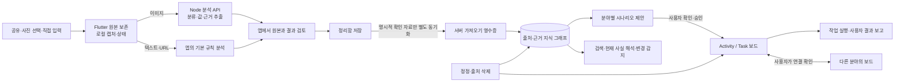
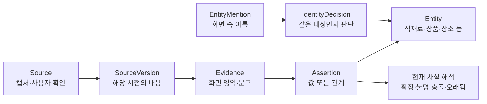

# Luffi 세컨드 브레인: 현재 구조와 검증 결과

**팀 공유용 · 2026-09-28 · 기준 브랜치 `dev` · 기준 커밋 `00ea7de`**

이 문서 한 장으로 **무엇을 만들고 있는지, 지금 실제로 동작하는 범위, 테스트가 증명한 것과 증명하지 않은 것**을 구분할 수 있게 정리했다. 이후 코드가 바뀌면 커밋과 테스트 결과를 다시 확인해야 한다.

## 1. 먼저 핵심만

Luffi의 목표는 캡처·공유한 정보를 다시 찾을 수 있는 **근거 있는 기억**으로 만들고, 사용자가 확인한 내용을 레시피·맛집·패션·뷰티·여행·생활 꿀팁·쇼핑·건강/운동의 **활동과 작업**에 연결하는 것이다. 레시피는 구조를 깊게 검증한 예시이며 서비스 전체 범위가 아니다. 하나의 자료가 여러 분야에 걸칠 수 있다.

현재 코드는 두 경로로 나뉜다.

| 경로 | 현재 할 수 있는 일 | 제품에서의 위치 |
| --- | --- | --- |
| **일반 앱 경로** | Android 공유·사진 선택 → 원본을 기기에 보존 → 분석·사용자 확인 → 정리함/태그와 기존 계획함에서 사용 | Flutter 앱의 기본 흐름. 정리함 검색은 로컬 콘텐츠·태그 기반이다. |
| **공통 커널 경로** | 확인된 구조화 자료를 서버 그래프에 별도 가져오기 → 분야별 시나리오 제안 → 사용자 승인 → Activity/Task 보드 → 분야 간 연결·정정·삭제 | 현재 **디버그 빌드의 개발용 보드**. 개발 토큰이 필요하다. 기존 계획함과 자동 동기화하지 않는다. |

따라서 **이미지를 저장했다고 그래프 사실이나 작업 보드가 자동으로 생기지 않는다.** 분석 결과는 화면에서 관찰한 후보이고, 사실 확정·계획 승인·행동 결과 보고는 각각 별도 단계다. 이 구분이 세컨드 브레인 구조의 중심이다.

## 2. 한눈에 보는 데이터 흐름

| 단계 | 저장되는 것과 판단 책임 |
| --- | --- |
| **1. 입력 보존** | Android의 공유 대기열을 앱 상태에 안전하게 저장한 다음 수신 완료 처리한다. 이미지 원본은 앱 전용 저장소에 남는다. 분석이 실패해도 입력을 잃지 않도록 하는 경계다. |
| **2. 분석** | 이미지는 서버 `/v1/analyze`가 분류·제목·필드·근거 영역·누락/충돌을 구조화한다. 텍스트·URL만 있는 입력은 앱의 기본 규칙으로 분석한다. 분석값은 **관찰 결과**이며 행동이나 물건의 동일성을 확정하지 않는다. |
| **3. 사용자 검토·정리** | 사용자가 원본과 결과를 보고 확인한 뒤 정리함에 저장한다. 구조화 이미지 화면에서는 태그를 선택할 수 있고, 필드 정정은 가져온 자료에 대해 이후 별도 화면에서 한다. 일반 정리함·태그·기존 계획은 앱 로컬 상태에 남는다. 새 캡처의 **명시적 확인**은 개발용 커널이 연결됐을 때 아래 가져오기를 예약한다. 빠른 정리로 저장한 항목과 기존 자료는 자동 가져오기 대상이 아니며, 기존 자료에는 별도 가져오기 명령이 있다. |
| **4. 공통 커널 가져오기** | 명시적으로 검토한 구조화 자료의 요청을 앱이 같은 가져오기 ID로 보존·재시도한다. 서버에는 분석 스냅샷·출처·근거·가져오기 영수증을 저장한다. **원본 이미지 바이트를 서버에 영구 보관하지는 않는다.** 가져와도 활동 보드가 자동으로 생성되지는 않는다. |
| **5. 활동화** | 사용자가 사용할 목적과 필요한 값·단위를 확인한다. 계획은 먼저 제안되고, **별도 승인 후** 작업 DAG가 보드에 적용된다. 구매·방문·착용·사용·운동·요리 완료는 해당 결과를 따로 보고해야 기록된다. |
| **6. 갱신** | 정정은 근거가 있는 현재 관계를 바꾸고 완료한 결과의 당시 입력을 보존한다. 출처 삭제는 그 출처에 의존한 그래프·보드·연결을 제거하고 독립 자료를 남긴다. |

주요 구현 위치: 앱 입력·상태 [`app_controller.dart`](../lib/state/app_controller.dart), 서버 가져오기 [`reviewed_capture_import_client.dart`](../lib/data/reviewed_capture_import_client.dart), 분석 [`analysis_service.js`](../server/src/analysis_service.js), 공통 커널 [`kernel_service.js`](../server/src/common/kernel_service.js), 개발용 보드 [`common_boards_screen.dart`](../lib/features/boards/common_boards_screen.dart).

## 3. 지식 그래프가 실제로 표현하는 것

그래프는 분야별로 완전히 분리된 표가 아니라 **공통 출처·근거·관계 모델**이다. PostgreSQL 사용 시 그래프는 소유자와 외래키가 있는 관계형 행으로 저장한다. 개발 기본값은 트랜잭션 JSON 파일이며, PostgreSQL에서도 활동·영수증 등의 일부 상태는 JSONB에 남는다.

예를 들어 이미지의 `두부 300g`은 먼저 **캡처에서 읽은 값**으로 저장된다. 사용자가 레시피 재료를 `tofu 300 g`으로 확인하면 **사용자 확인 출처**가 추가되고, 그 근거로 레시피의 재료·분량 관계가 생긴다. 같은 이름의 상품이나 식당이 보여도 실제로 같은 대상이라고 자동 병합하지 않는다. 근거가 없거나 충돌하는 값은 확정 사실로 승격하지 않는다.

검색·조회 API는 소유자와 활성 출처·근거를 다시 검사하고, 현재 관계를 `resolved / unknown / disputed / stale`처럼 해석한다. 변경 감지용 watch도 있다. **일반 정리함 검색이 이 그래프 검색으로 전환된 상태는 아니다.** 현재 개발 API의 검색은 이름·유형·외부 ID와 제한된 관계 탐색 중심이며, 대규모 그래프의 SQL 부분 조회나 완성된 대화형 AI 기억 검색은 아직 아니다. 구현·계약은 [공통 커널](COMMON_KERNEL.md)과 [`knowledge`](../server/src/knowledge/), [`retrieval`](../server/src/retrieval/)에 있다.

## 4. 작업 보드와 분야별 확장 방식

공통 보드는 **Activity(목적) → PlanRevision(계획안) → Task(선행조건·입출력) → TaskResult(실행 결과)** 구조다. 승인 전 계획은 실행되지 않는다. 작업의 재시도는 명령 ID로 중복 적용을 막고, 근거·입력이 바뀌면 오래된 계획이나 미시작 작업을 다시 검토한다. 이미 완료한 결과를 새 값으로 조용히 덮지 않는다. 현재 레시피 등 작업 틀은 등록된 분야 규칙으로 결정하며, AI가 자유롭게 목적을 읽고 계획을 생성하는 범용 흐름은 연결되지 않았다.

| 분야 | 현재 구현된 대표 작업·판단 경계 |
| --- | --- |
| 레시피 | 사용자가 재료·단위·인분을 확정 → 인분 계산·재고 확인·필요량 계산·요리 결과 기록. `재고 미확인 ≠ 0`; `약간`에 임의 수치를 붙이지 않는다. |
| 맛집 | 지점 후보 확인·방문 결과. 같은 상호의 다른 지점을 자동 병합하지 않고, 선택만으로 방문 기록을 만들지 않는다. |
| 패션 | 코디·옵션·소유 상태 확인·착용 결과. 화면의 옵션과 실제 소유·착용을 구분한다. |
| 뷰티 | 제품·루틴 단계·순서 확인·단계별 사용 결과. 사용하지 않은 단계에 사용 경험을 만들지 않는다. |
| 여행 | 장소·순서·예정 시각 확인·방문 결과. 일정에 넣은 것과 실제 방문을 분리한다. |
| 생활 꿀팁 | 근거 있는 단계 선택·실행 결과. 저장한 팁을 실천으로 간주하지 않는다. |
| 쇼핑 | 표시 가격·상품 선택·실제 구매 결과·사후 재고를 분리한다. 캡처의 `2,400원`을 결제액으로 취급하지 않는다. |
| 건강·운동 | 운동 항목·목표 계획과 실제 수행량·수행 결과를 분리한다. |

분야 간 연결도 사용자 확인 관계다. `recipe_shopping`, `travel_dining`, `fashion_beauty`, `health_life_tip` 등의 명명 관계와 일반 `related`가 있다. **연결만으로 양쪽 작업을 완료하거나 사실을 합치지 않는다.** 레시피 필요량을 쇼핑 보드에 보여주는 것은 읽기 전용이며, 쇼핑 계획에 반영하려면 변경안을 만들고 다시 승인해야 한다. 상세 규칙은 [분야 연결 계약](SCENARIO_CONNECTIONS.md)에 있다.

## 5. 테스트를 읽는 방법: 증거의 강도가 다르다

| 검증 종류 | 지금 확인된 것 | 이 결과만으로 말할 수 없는 것 |
| --- | --- | --- |
| **자동 회귀** | 서버의 그래프·분야별 시나리오·정정/삭제·작업 실행 테스트, Flutter 상태·화면 테스트가 있다. JSON/PGlite와 선택적 실제 PostgreSQL 통합 검증을 구분한다. | 실제 휴대폰의 공유·권한·네트워크 동작, 현재 모델 응답의 정확도 |
| **공개 합성 이미지 21장** | 이미지 해시와 이전 **실제 분석 호출에서 보존한 응답**의 분류·제목·근거 참조를 재생해 반복 검사한다. 분야별 입력 예시는 [시나리오·이미지 검증 안내](TEST_VALIDATION_GUIDE.md)에 있다. | 새 모델의 오늘 결과나 실제 SNS 자료의 정확도. `21/21`은 정확도 100%가 아니다. |
| **합성 이미지 새 모델 호출** | 분야별 `test:*image-live` 스크립트와 아래 Android 검증은 이미지를 실제 분석 API에 보내 결과를 확인한 기록이 있다. | 해당 이미지 밖으로 일반화한 성능 통계. 모델·프롬프트가 바뀌면 다시 확인해야 한다. |
| **Android 수동 E2E** | 실제 기기와 에뮬레이터에서 아래의 입력→분석→그래프→보드 경로를 직접 조작했다. | iOS 실기기, 모든 외부 앱·형식·제조사, 실제 사용자 자료의 품질 |
| **실제 자료 평가** | 동의·라벨·개발/최종 세트 분리·해시·실행 기록을 검사할 도구와 계약을 준비했다. | 실제 자료의 분야별 정확도·속도·오류율은 **아직 산출하지 않았다.** |

**이번 문서 작성 시 다시 실행한 기본 검사(2026-09-28):** 서버 `npm test --prefix server`는 **601개 중 598개 통과·3개 건너뜀·실패 0개**였다. 건너뛴 3개는 이 실행에 별도 테스트용 PostgreSQL 주소가 없어 실행되지 않은 선택 테스트다. Flutter `flutter analyze --fatal-infos`는 문제없었고 `flutter test`는 **521개 통과**했다. Android Kotlin `:app:testDebugUnitTest`는 **26개 통과**했다. `npm run test:corpus-report --prefix server`는 공개 합성 이미지 **21/21**의 저장 응답 회귀를 통과했다(뷰티 2·맛집 5·패션 2·운동 1·생활 꿀팁 2·레시피 2·쇼핑 5·여행 2). 실제 PostgreSQL과 새 모델의 분야별 품질을 이 숫자에 포함하지 않는다.

| 자동 테스트가 확인하는 핵심 규칙 | 대표 테스트 파일 |
| --- | --- |
| 수신한 공유의 보존·재시도, 이미지 형식/서명 검사, 앱 상태 복원 | [앱 상태](../test/state/app_controller_test.dart), [Android 단위 테스트](../android/app/src/test/) |
| 분석 스키마·근거 참조, 검토한 캡처의 출처/필드 가져오기, 중복 요청 방지 | [분석](../server/test/analysis_service.test.js), [가져오기](../server/test/ingestion_reviewed_capture.test.js) |
| 출처·소유자·근거에 따른 관계 해석, 동명 대상의 자동 병합 방지, 검색 시 현재 근거 재검증 | [그래프](../server/test/knowledge_kernel.test.js), [검색](../server/test/retrieval_graph.test.js) |
| 계획 승인 전 실행 차단, 작업 의존성, 결과의 당시 입력 보존, 오래된 계획 거부 | [작업](../server/test/activities_kernel.test.js), [통합](../server/test/common_kernel_integration.test.js) |
| 분야별 사용자 결과만 행동 사실로 기록, 정정·출처 삭제 시 영향 범위 제한 | [분야 변형](../server/test/scenario_variations.test.js), [분야 연결](../server/test/scenario_connections.test.js), [삭제 기록](../server/test/deletion_ledger.test.js) |
| JSON/PGlite 저장·롤백·재시작 및 별도 테스트 DB가 있을 때 실제 PostgreSQL 동작 | [JSON 저장](../server/test/json_state_store.test.js), [관계형 저장](../server/test/postgres_relational_store.test.js), [실제 DB 선택 테스트](../server/test/postgres_real_integration.test.js) |

### 팀원이 따라 읽기 쉬운 대표 검증: 두부 레시피 → 쇼핑

| 순서 | 입력/결정 | 관찰한 결과 |
| --- | --- | --- |
| ① 공유·분석 | 합성 [레시피 PNG](../server/test/fixtures/variation_recipe_tofu_egg_as_needed.png), [쇼핑 PNG](../server/test/fixtures/variation_shopping_tofu_ingredient.png)를 실물 Android에서 공유 | 실제 분석 API가 `두부 달걀 볶음 / 레시피 / 내용 충분`, `부침용 두부 300g / 상품 / 내용 충분`로 표시했다. 상품의 `2,400원`은 **캡처 표시 가격**이다. |
| ② 검토·저장 | 두 결과의 원본을 보고 `정리함에 저장` | 격리 서버에 서로 다른 가져오기 영수증 2개와 활성 캡처 출처 2개가 생겼다. |
| ③ 사용자가 레시피 확정 | 기준·목표 각 2인분, 두부 `300 g`, 달걀 `2 count`를 직접 입력·확인하고 계획 승인 | 레시피 보드 1개와 작업 4개, 근거가 있는 재료·분량 관계가 생겼다. 분석값을 자동 확정한 것이 아니다. |
| ④ 쇼핑 승인·연결 | 합성 상품을 고르고 쇼핑 목적 입력·계획 승인 → 레시피에 필요한 쇼핑으로 연결 | 쇼핑 보드 작업 2개와 활성 연결 1개. 구매 결과는 여전히 없다. |
| ⑤ 필요량 반영 | 레시피 인분 계산 → 두 재고 빈칸(미확인) → 필요량 계산 → 쇼핑 변경안 별도 승인 | 쇼핑 화면에 두부 `300 g`·달걀 `2 개`와 **재고 미확인**이 보였다. 상품 자동 선택·구매는 없었다. |
| ⑥ 출처 삭제·재시작 | **합성 쇼핑 출처 하나만** 삭제하고 열린 보드 새로고침 → 앱 종료·재실행 | 쇼핑 보드와 연결이 사라지고 독립 레시피 보드만 남았다. 삭제 기록 검사 `safe`, 기록 3건. 구매·요리 완료 주장 0건. |

위 **2026-09-28 실물 기기**는 Samsung Galaxy SM-S916N(Android 16/API 36)이다. Android 시스템 공유 시트를 실제로 거쳤지만 이미지 발신자는 테스트 도구 `com.android.shell`이었다. PNG를 `image/jpeg`로 선언한 형식 불일치도 앱이 처리했다. **Google Photos 앱에서 직접 공유한 실기기 테스트는 아니다.** Google Photos 외부 공유와 서버 중단→재시도는 API 35 에뮬레이터에서 확인했다. 전날 실물 기기에서는 앱 내부 사진 선택기로 두 이미지를 가져와 보드·삭제·재시작까지 검증했다. 실행별 범위는 [Android 검증 원기록](ANDROID_E2E_VALIDATION.md)에 분리해 적었다.

### 여덟 분야의 자동 테스트 범위

레시피의 재료·순서·수량 정정, 맛집의 지점 분리, 패션의 옵션·착용, 뷰티의 루틴 단계·사용, 여행의 일정·방문, 생활 꿀팁의 단계·실천, 쇼핑의 표시가·실결제·재고, 운동의 목표·수행을 **각 분야 규칙으로** 검사한다. 연결 테스트는 레시피↔쇼핑, 여행↔맛집, 패션↔뷰티, 운동↔팁 등의 연결·변경·삭제를 다룬다. 세부 입력 이미지, 저장 응답, 테스트 파일은 [검증 안내](TEST_VALIDATION_GUIDE.md#분야별로-무엇을-확인했나)의 분야별 표에서 볼 수 있다. 현재 실물 기기에서 끝까지 반복한 분야는 **레시피·쇼핑**이며 나머지 여섯 분야의 실물 사용자 흐름을 완료했다고 말하지 않는다.

## 6. 현재 구현과 미완료의 경계

| 현재 가능한 것 | 아직 완료/검증으로 부르지 않는 것 |
| --- | --- |
| 근거 있는 그래프와 사용자 확인·정정·삭제, 8개 분야의 개발용 작업 보드와 분야 간 관계 | 일반 정리함/기존 계획함과 공통 커널 보드의 완전한 통합·자동 이전 |
| JSON 개발 저장소와 PostgreSQL 관계형 그래프 저장·마이그레이션·선택적 실제 DB 테스트 | 대규모 그래프의 SQL 부분 조회, 운영 부하·무중단 복구 검증 |
| 개발용 단일 사용자 Bearer 토큰과 삭제 기록 파일을 이용한 격리 검증 | 다중 사용자 운영 인증·권한, 서버 원본 이미지의 영구 보관, 실제 알림 전달, 외부 구매·예약 실행 |
| Android 합성 이미지 실기기 E2E와 Google Photos 에뮬레이터 공유 | 실물 Google Photos 직접 공유, iOS 실기기 공유 E2E, 실제 자료의 추출 품질·안전성·성능 수치 |

초기 [제품 문서](PRODUCT.md)와 [로드맵](ROADMAP.md)은 **뷰티 중심의 당시 목표**를 담고 있다. 현재 다분야 커널의 완료 범위는 이 문서와 코드·테스트를 기준으로 판단한다. 현재의 개발용 토큰·서버 설정을 운영 준비 완료로 해석하지 않는다.

## 7. 다음 단계와 상세 자료

다음 검증 순서는 **실물 Google Photos 등 실제 외부 앱 공유의 짧은 보완 → 동의받은 실제 자료의 분야별 라벨·개발/최종 세트 분리 → 오류 유형별 개선**이다. 합성 이미지 재생 테스트와 실제 자료 평가 점수는 합산하지 않는다. 실제 자료 평가 계약과 삭제 복구 경계는 [실제 데이터 직전 게이트](REAL_DATA_READINESS.md)에 있다.

- 데이터·API·그래프·작업의 상세 계약: [공통 커널](COMMON_KERNEL.md)
- 분야 연결의 방향과 갱신 조건: [시나리오 연결](SCENARIO_CONNECTIONS.md)
- 분야별 입력→추출→확인→결과와 테스트 파일: [시나리오·이미지 검증 안내](TEST_VALIDATION_GUIDE.md)
- Android 실물 기기/에뮬레이터 실행별 원기록: [Android E2E 검증](ANDROID_E2E_VALIDATION.md)
- 실제 자료 평가 전 보호·라벨·분할: [실제 데이터 직전 게이트](REAL_DATA_READINESS.md)

팀원에게 가장 중요한 해석 원칙은 하나다. **캡처의 문구, 사용자가 확인한 계획, 실제로 수행했다고 보고한 결과는 서로 다른 근거와 기록이다.** Luffi는 이 차이를 보존하는 세컨드 브레인으로 개발 중이다.
